#  End-to-End Incident Response & Forensics Lab

This project demonstrates a full end-to-end incident response workflow using a Windows endpoint monitored by Wazuh SIEM.  
The lab simulates a **brute-force authentication attack**, followed by **post-compromise reconnaissance**, **data staging**, **forensic evidence preservation**, **timeline reconstruction**, and a **formal SOC incident report**.

The goal of this lab is to demonstrate practical SOC analyst and DFIR skills, focusing on investigation quality, evidence handling, and clear documentation — not just tool usage.

---

##  Lab Environment

- **SIEM:** Wazuh (Ubuntu VM)
- **Endpoint:** Windows 10 VM with Wazuh Agent
- **Logs & Telemetry:**
  - Windows Security Event Logs
  - PowerShell Operational Logs
  - Sysmon
  - Wazuh File & Registry Integrity Monitoring
- **Tools Used:**
  - Wazuh Dashboard
  - Windows PowerShell
  - VS Code (timeline & incident report)

---

##  Skills Demonstrated

- SIEM monitoring and alert triage  
- Brute-force authentication detection (Event ID 4625)  
- PowerShell attack detection and analysis  
- File and registry integrity monitoring  
- Evidence preservation and chain of custody  
- Cryptographic hashing (SHA256)  
- Incident timeline reconstruction  
- SOC-style incident reporting  

---

##  Incident Response Walkthrough (Step-by-Step)

---

### Lab Preparation
A dedicated incident response working environment was prepared on the Windows endpoint to ensure a structured investigation.

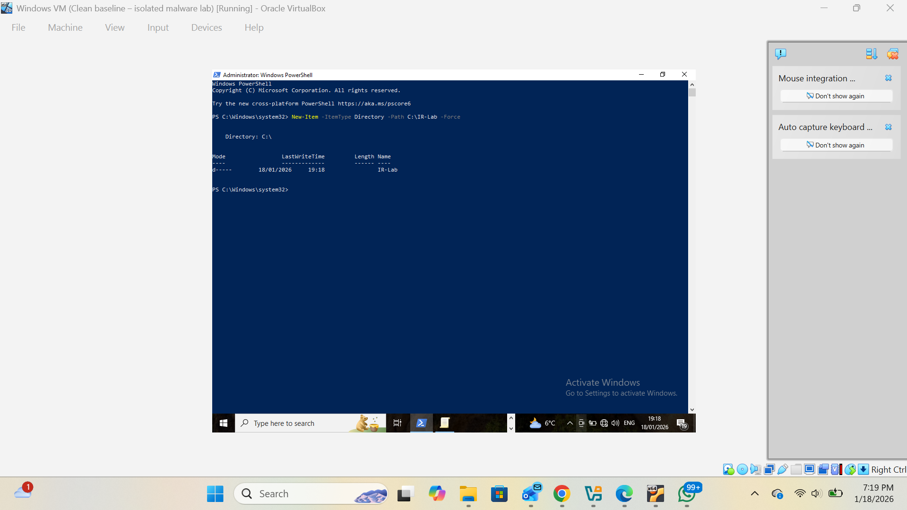

---

### Network Connectivity Verification
Connectivity between the Windows endpoint and the Ubuntu SIEM server was verified to ensure reliable telemetry delivery.

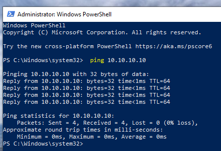

---

### Wazuh Agent Verification
The Windows endpoint was confirmed as active and reporting within the Wazuh dashboard.

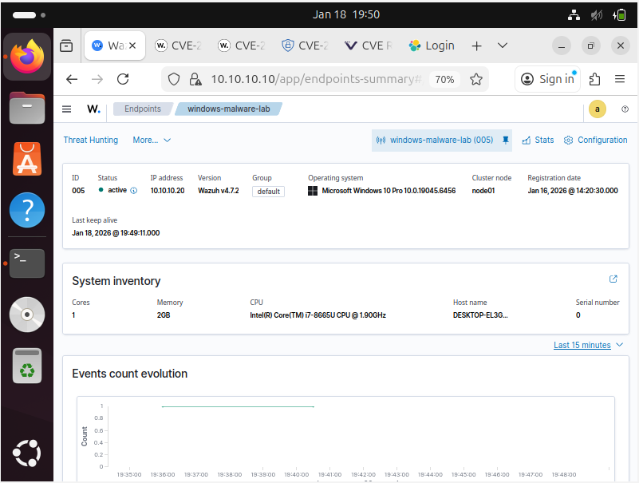

---

### Baseline Telemetry Validation
Normal Windows events were reviewed prior to attack simulation to establish a clean baseline.

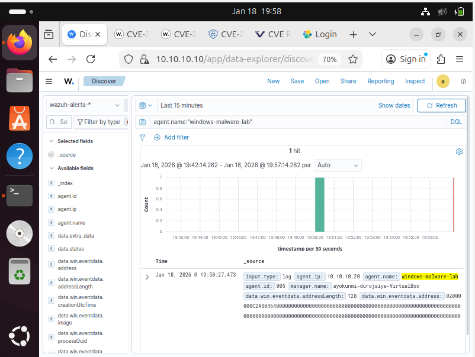

---

### Sensitive Data Creation
A simulated sensitive dataset was created on the Windows host to represent a realistic attacker objective.

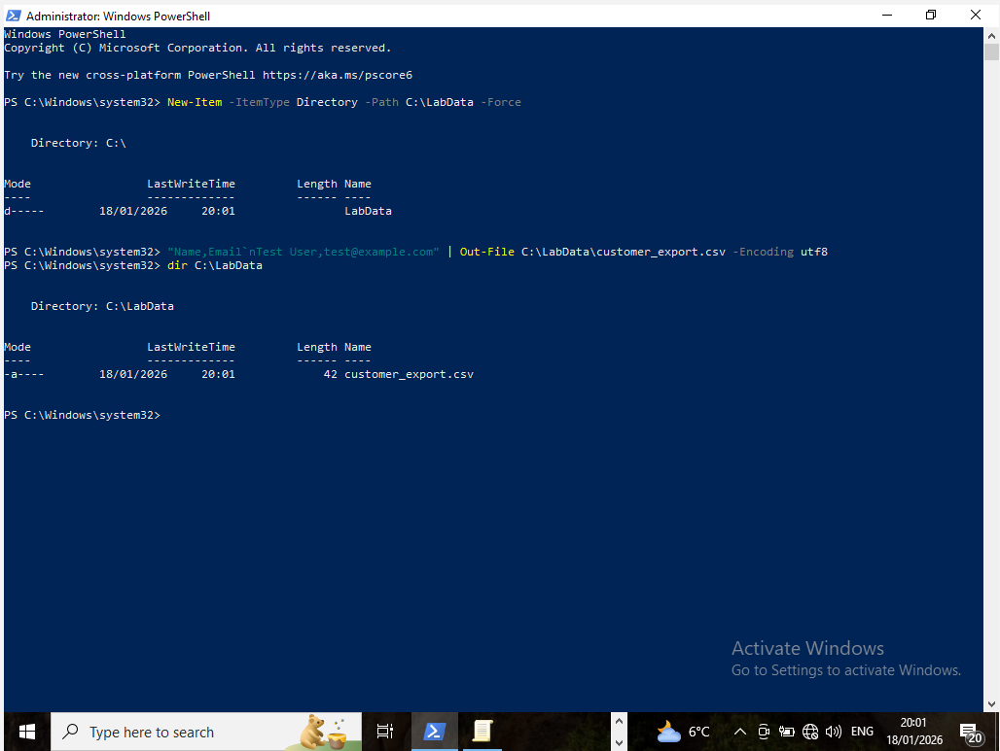

---

### Brute-Force Authentication Simulation
Multiple failed authentication attempts were generated, simulating a brute-force attack against a local user account.

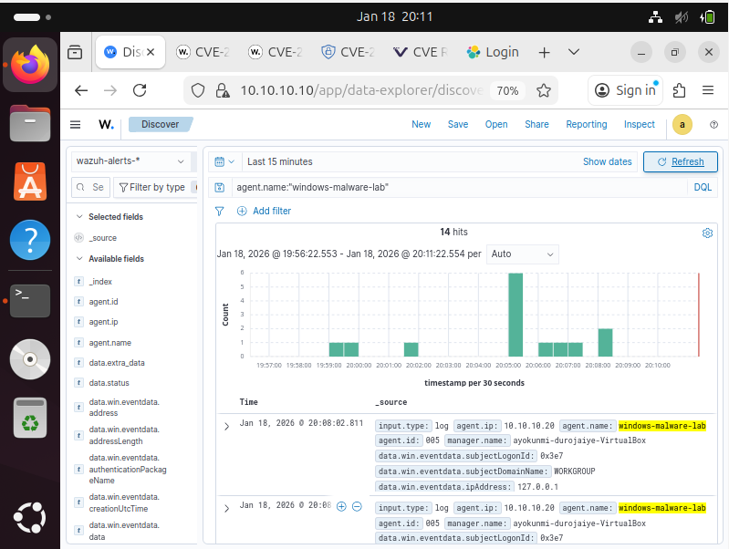

---

### Post-Compromise Reconnaissance
PowerShell reconnaissance commands were executed to enumerate user context, system identity, network configuration, and privileges.

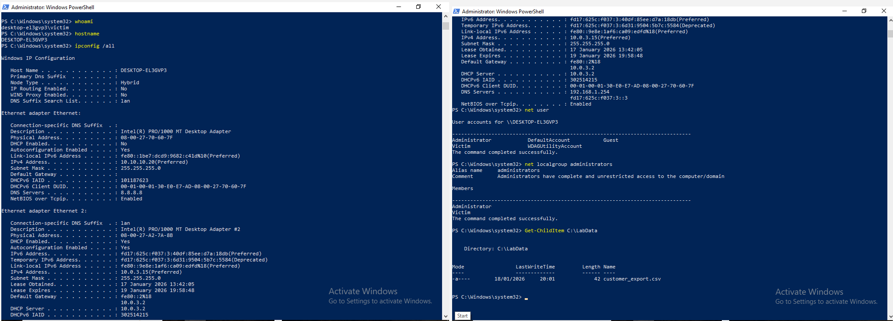

---

### Data Staging & Compression
Sensitive data was staged in a public directory and compressed into an archive (`loot.zip`), simulating preparation for exfiltration.

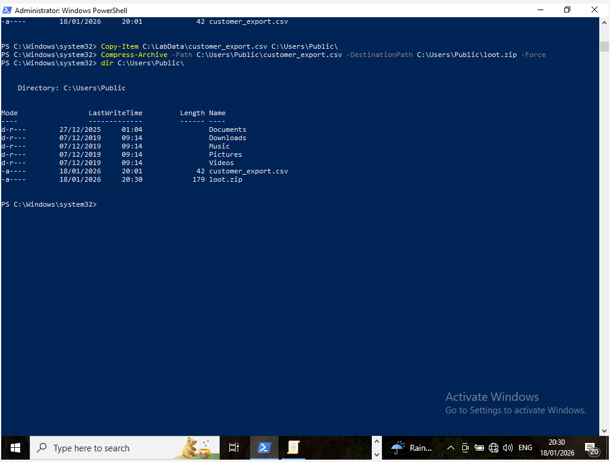

---

### Brute-Force Validation (Event ID 4625)
Windows Security Event ID **4625** was analysed to confirm repeated authentication failures consistent with brute-force behaviour.

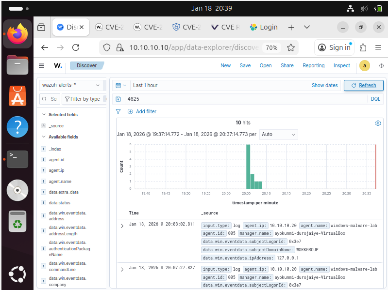

---

### System Integrity Monitoring
Wazuh File and Registry Integrity Monitoring detected a registry modification, confirming system-level changes during the incident.

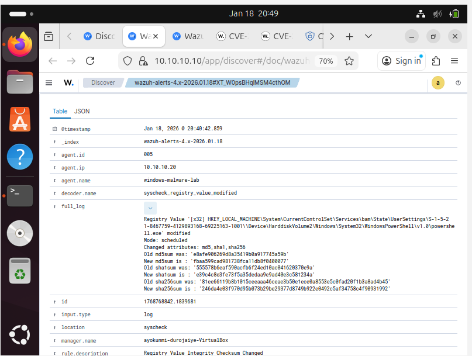

---

### Forensic Evidence Preservation
Relevant Windows event logs were exported in native EVTX format to preserve forensic evidence.

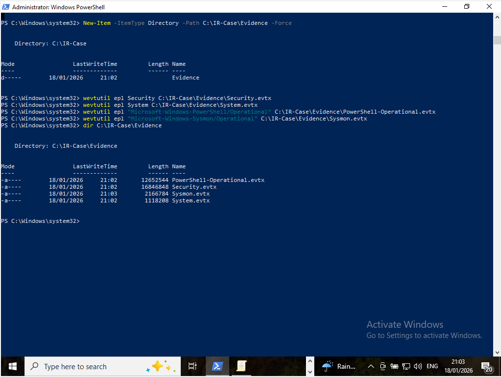

---

### Evidence Integrity Verification
SHA256 hashes were generated for all critical forensic artifacts to maintain chain-of-custody integrity.

---

### SIEM Evidence Export
Relevant Wazuh alerts were exported into an on-demand report for offline analysis and documentation.

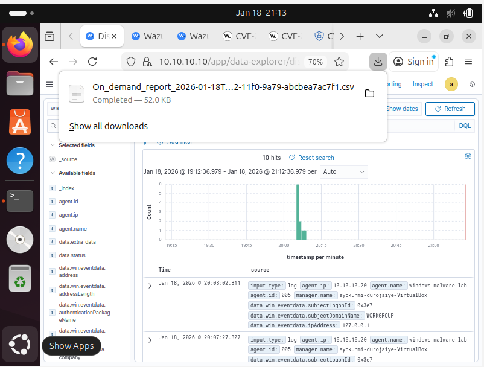

---

### Incident Timeline Reconstruction
A complete incident timeline was reconstructed by correlating Windows logs, PowerShell activity, and Wazuh alerts.

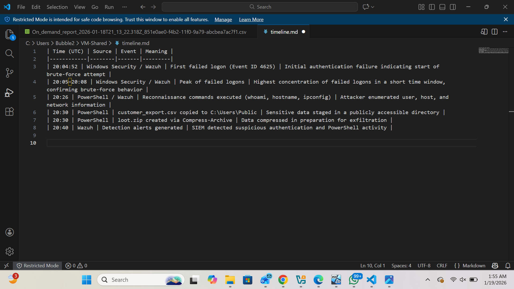

---

### Final SOC Incident Report
A full L1 SOC-style incident report was produced, documenting findings, impact assessment, and response recommendations.

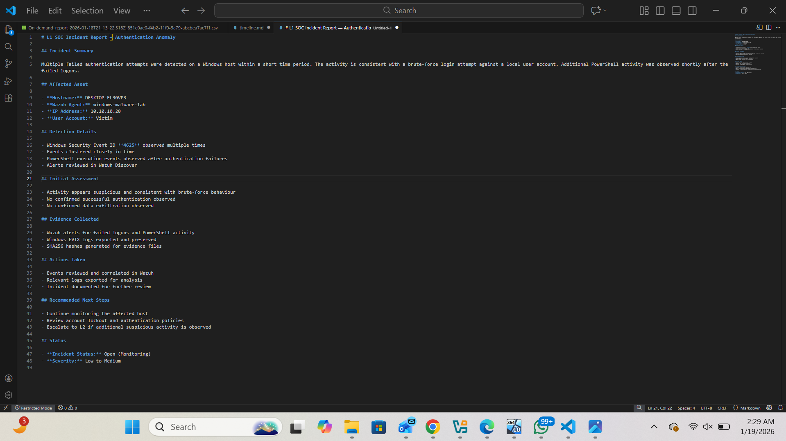

---

## Key Takeaway

This lab demonstrates a realistic end-to-end incident response workflow:

**Detection → Investigation → Forensics → Evidence Integrity → Timeline → Reporting**

The project reflects real SOC and DFIR practices, making it suitable for junior SOC analyst and incident response roles.
